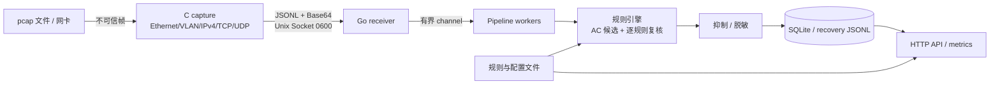

# NetSentry 全面审计与整改报告

> 审计日期：2026-07-11
> 审计基线：`608e7f3`（`main`）
> 范围：C capture、Go engine、Unix Socket IPC、SQLite、HTTP API、规则与 MITRE ATT&CK 映射、测试/发布流水线、Obsidian 知识治理
> 状态：整改执行中；本文件在后续阶段持续追加验证结果与路线图。

## 1. 执行摘要

NetSentry v0.1.0 已具备清晰的双进程边界、逐字段边界检查、不可变规则快照、SQLite 参数化查询/恢复日志、race/ASan/fuzz/E2E/pressure 门禁，工程成熟度明显高于普通早期原型。审计基线 `make test`、C ASan 单测、`go vet ./...`、`govulncheck ./...` 均通过；Go 语句覆盖率为 **74.2%**。

当前主要风险不是已知第三方依赖漏洞，而是安全默认值和契约一致性：HTTP API 默认监听所有接口且写接口认证默认关闭；请求 body、header 和连接缺少完整上限；规则加载器允许重复 ID、空配置和不完整 MITRE 数据进入状态构建；多 MITRE 映射在告警阶段只取第一个元素；C capture 未验证 pcap 链路类型，`-c` 使用 `atoi` 导致非法值可能被解释为无限/超大重试。性能方面，配置中的 `worker_count` 未实际驱动 worker 数量，live capture 的同步 UDS 写入会把背压传导到 libpcap。

本轮整改优先修复能够保持兼容且可验证的问题。需要数据库 schema、TCP 重组、IPv6 或外部基础设施的事项进入路线图，不以一次性大改冒充已完成。

## 2. 架构与信任边界

信任边界：

- pcap、live packet、UDS frame、HTTP 请求均视为不可信输入。
- 规则、配置和 suppression 文件属于本地主机管理面输入；仍需防止错误配置造成崩溃或静默失效。
- UDS 依赖文件权限隔离而非消息级认证；默认 `0600` 时其他 Unix 用户不可连接，同 UID 进程仍在同一信任域。
- HTTP API 是管理面与数据面读取接口。若监听非 loopback，必须启用认证并由 TLS 反向代理或受控网络承载。

## 3. 基线验证

| 检查 | 结果 | 备注 |
|---|---:|---|
| `make test` | PASS | C 单测 + Go `-race -count=1` |
| `make asan-test` | PASS | C parser / UDS sender |
| `go vet ./...` | PASS | 无诊断 |
| `govulncheck ./...` | PASS | 0 个可达漏洞；依赖模块中 1 个不可达漏洞 |
| `make test-coverage` | PASS | Go 总语句覆盖率 74.2% |
| C 编译告警 | PASS | `-Wall -Wextra` 无告警 |
| 外部 pcap corpus | 待阶段 2 | 基线仅含 synthetic corpus |

注意：工作树在审计开始前已有 3 处用户变更：`docs/evidence/release-v0.1.0.md`、`docs/tasks/task-state-20260711-044844.json`、`docs/plans/task-20260711-123631.md`。本轮不覆盖、不纳入审计提交。

## 4. 安全与代码质量发现

### 高风险

#### NS-SEC-001：管理 API 默认暴露到所有接口且写认证关闭

- 位置：`engine/cmd/netsentry/main.go:139-166`（`startHTTPServer`）、`configs/config.yaml:23-31`。
- 证据：server 地址为 `fmt.Sprintf(":%d", port)`；默认 `api_auth_enabled: false`。
- 影响：在主机防火墙、容器端口映射或部署网络配置不严时，远程访问者可读取告警/网络元数据，并创建、更新、删除、重载检测规则和 suppression。
- 修复：新增显式 `api_listen_addr`，默认 `127.0.0.1:8080`；保留非 loopback 部署能力，但配置校验要求此时启用非空 Bearer token；更新 Docker/文档说明。
- 缓解：在修复前只监听 loopback/隔离网络，不发布 8080，或开启 Bearer 认证并置于 TLS 反代之后。

#### NS-SEC-002：HTTP 资源上限不完整，可被慢连接或大 JSON body 消耗资源

- 位置：`engine/cmd/netsentry/main.go:142-158`；`engine/internal/api/router.go:499-507, 683-692`。
- 证据：仅设置 `ReadHeaderTimeout`；未设置 `ReadTimeout`、`WriteTimeout`、`IdleTimeout`、`MaxHeaderBytes`；两个 JSON mutation decoder 未使用 `http.MaxBytesReader`。
- 影响：可达 API 的客户端可用超大 body/header 或慢请求长期占用内存和连接。
- 修复：设置完整 server timeouts/header limit；mutation body 限制为 1 MiB；拒绝尾随 JSON 文档。

### 中风险

#### NS-RULE-001：规则集合缺少全局结构校验

- 位置：`engine/internal/rule/engine.go:166-243`（`buildState`）。
- 证据：直接解引用 rule 指针，`ruleByID[r.ID] = i` 覆盖重复 ID；未知类型仍进入 `allByPriority`；空 keyword/IP/port 集合可静默生成永不命中的 enabled rule。
- 影响：本地错误或被篡改规则文件可导致启动 panic、规则状态歧义或检测能力静默缺失。
- 修复：集中验证 nil、ID 唯一性、支持类型、severity、配置非空和 MITRE 字段，并以错误返回保留旧快照。

#### NS-MITRE-001：多映射被静默截断，且未校验 ID/战术/名称一致性

- 位置：`engine/internal/rule/engine.go:524-544`（`buildAlert`）、`engine/pkg/model/alert.go`。
- 证据：规则支持 `[]MITRETechnique`，告警和 SQLite 仅保存 `[0]`。
- 影响：一条规则配置多个 technique 时，后续映射丢失但无错误；拼错的 technique ID、tactic 或 name 会进入 API/SQLite，污染分析和报表。
- 修复：v0.1.x 明确限制每条规则最多一个映射并用内置 canonical catalog 校验；v0.3.0 迁移为多值告警 schema。

#### NS-CAP-001：pcap 数据链路类型未验证

- 位置：`capture/src/main.c:137-183`。
- 证据：所有输入均交给 Ethernet parser，但未检查 `pcap_datalink(handle) == DLT_EN10MB`。
- 影响：Linux cooked、raw IP、802.11 等 capture 会被误解析为 Ethernet，产生大量 parse error 或错误字段，而不是明确拒绝。
- 修复：启动时拒绝非 Ethernet DLT，并加入外部 corpus integration 测试。

#### NS-CAP-002：重试参数解析不安全且信号类型不符合异步信号约束

- 位置：`capture/src/main.c:37, 95`。
- 证据：`atoi(optarg)` 无错误/范围检查；负数随后转换为 `unsigned int`；handler 标志为 `volatile int` 而非 `volatile sig_atomic_t`。
- 影响：输入 `-c nope` 会被解释为 0（无限重试），负值可能变成极大次数，导致离线任务挂起；信号标志的可移植性不足。
- 修复：用 `strtoul` 严格解析并限制范围，采用 `volatile sig_atomic_t`。

#### NS-IPC-001：receiver 每连接 goroutine 与 1 MiB frame 上限偏大

- 位置：`engine/internal/receiver/uds_listener.go:113-153`。
- 证据：每个本地连接启动 goroutine；scanner 允许 1 MiB，但 capture 最大合法 frame 远小于该值。
- 影响：同 UID 恶意/失控进程可建立大量连接并发送大行造成内存压力。
- 修复：降低合法 frame 上限、对超限记录 decode error；并在路线图中加入连接并发上限。默认 0600 socket 是当前主要缓解。

#### NS-PERF-001：`worker_count` 配置未生效

- 位置：`configs/config.yaml`、`engine/cmd/netsentry/main.go:112-115`。
- 证据：配置声明 `worker_count`，主程序只启动一个 `Worker.Run`。
- 影响：多核主机仍串行执行 base64 解码、AC 匹配、脱敏与 SQLite 写入；配置具有误导性。
- 修复：按校验后的 worker count 启动共享安全 worker pool；保留有界 channel 与 context shutdown。

### 低风险 / 技术债

#### NS-API-001：request ID 信任任意客户端字符串

- 位置：`engine/internal/api/errors.go:35-40`。
- 影响：超长或控制字符 request ID 会降低日志/错误关联质量；Zap JSON 降低了直接日志注入影响。
- 建议：限制字符集与长度，无效值生成服务端 ID。

#### NS-CONFIG-001：多个配置项未接线或校验不足

- `capture.payload_preview_len`、`capture.heartbeat_interval` 由 YAML 声明，但独立 C binary 不读取 YAML。
- `engine.alert_aggregation_max_count` 未传给 store。
- `engine.cors_allowed_origins` 当前未实现；保持“无 CORS”在安全上是 fail-closed，但文档/配置造成预期偏差。
- `logging.level`、`logging.engine_log` 未应用。
- 建议：在 v0.2.0 统一配置契约，未实现字段要么接线、要么明确标为 reserved 并验证。

#### NS-PERF-002：规则匹配和 capture 背压的扩展性边界

- AC trie 每节点固定 `[256]*node`，内存随关键词总字节增长较快。
- payload 每包 base64 decode；AC 候选后每条规则再次扫描 window。
- C capture 同步写 UDS；engine/SQLite 变慢会阻塞 capture，live mode 可能转化为 libpcap/kernel drop。
- 建议：v0.2.x 加入 matcher/queue/UDS 基准预算与 live drop telemetry；v0.3.0 评估稀疏 trie、批量 IPC 或环形缓冲。

## 5. MITRE ATT&CK 映射审查

审查基于 MITRE Enterprise ATT&CK 在线 technique 定义（核对日期 2026-07-11）。网络 payload signature 只能表明“与某 technique 一致的网络指标”，不能证明主机端 technique 已成功执行，因此告警文档需保持“推断/候选映射”语义。

| 规则 | 当前映射 | 结论 | 整改 |
|---|---|---|---|
| SQL Injection | T1190 / Initial Access | 合理，但依赖目标确为 public-facing | 保留并注明推断 |
| XSS | T1190 / Initial Access | 可接受；仅检测输入不等于成功利用 | 保留 |
| Path Traversal | T1083 / Discovery | 不准确：T1083 描述已入侵主机上的文件/目录枚举；网络路径穿越请求更接近利用 public-facing app | 改为 T1190 |
| Shell Command Injection | T1059 / Execution | 合理但过宽 | 收敛为 T1059.004（Unix Shell），与当前关键词一致 |
| Log4Shell | T1190 / Initial Access | 准确 | 保留 |
| Known C2 IP | T1071 / C2 | 证据偏弱：仅 IP 命中不能确认 application-layer protocol | 保留为低置信推断并在路线图增加 flow/protocol 证据；避免宣传为已确认 C2 technique |
| Scanner UA | T1595 / Reconnaissance | 准确 | 保留 |
| Reverse Shell | T1059.004 / Execution | 合理，但只能说明 payload 指标 | 保留 |

Canonical 参考：

- <https://attack.mitre.org/techniques/T1190/>
- <https://attack.mitre.org/techniques/T1083/>
- <https://attack.mitre.org/techniques/T1059/004/>
- <https://attack.mitre.org/techniques/T1071/>
- <https://attack.mitre.org/techniques/T1595/>

## 6. 测试体系差距

现有测试的优点：C parser/UDS 单测与 ASan fuzz；Go rule/store/API/receiver/pipeline race tests；synthetic E2E；压力与 release gate。主要差距：

1. 缺少有来源、固定 revision、checksum、许可证说明的外部 pcap corpus。
2. 缺少非 Ethernet DLT、非法 CLI 参数、IPv4 version、null pointer defensive tests。
3. 缺少规则重复 ID、nil rule、空配置、canonical MITRE 校验测试。
4. 缺少 API body 上限、尾随 JSON、listen security validation 和完整 server timeout 合同测试。
5. 外部 corpus 测试尚未拆分为可快速运行的 integration/E2E 与可调规模 stress 两档。

## 7. 行动清单

### P0：本轮必须完成

- [x] 默认 API 改为 loopback，非 loopback 强制认证。
- [x] HTTP server 增加完整 timeout/header/body 上限和严格 JSON 文档校验。
- [x] 规则集合与 MITRE canonical 校验，拒绝 silent truncation/duplicate/nil/empty enabled rule。
- [x] C 严格解析 `-c`、校验 Ethernet DLT、修正 signal flag、补 defensive parser tests。
- [x] 让 `worker_count` 生效并补并发 shutdown/race 测试。
- [x] 建立外部 pcap asset manifest、checksum、license/source 管理脚本。
- [x] 增加 unit、integration、E2E、stress 入口并纳入可重复验证。
- [x] 中英文 README 同步、知识库实质性笔记、本机 post-push 精确范围同步。

### P1：v0.2.x

- [ ] 限制 UDS 并发连接并将 frame contract 常量在 C/Go 间生成或共享。
- [ ] 接线或删除 reserved config，加入严格 YAML unknown-field 检查。
- [ ] 将 C capture 配置与 Go engine 配置统一为明确的启动契约。
- [ ] 在 CI 增加 `govulncheck`、外部 corpus checksum 校验、GitHub Actions SHA pinning。
- [ ] 加入 IPv6、pcapng 多接口/DLT 处理策略与 TCP stream reassembly 设计。

### P2：v0.3.0

- [ ] 告警/SQLite 支持多 MITRE technique、mapping confidence/evidence basis 和 ATT&CK catalog version。
- [ ] 实现 TCP/IP fragment/stream reassembly 后再提升应用层 signature 可信度。
- [ ] 建立性能回归预算（pps、p95 match latency、RSS、drop rate）。

## 8. 无法在本地直接闭环的事项

- 知识库按维护者决策固定为本机 sibling Vault，不上传远端，也不依赖 GitHub artifact、独立知识仓库或 self-hosted runner。跨机器执行不会自动获得该 Vault；本机开发通过 post-push hook 和确定性抽取脚本闭环。
- 外部 pcap 即使来自开源仓库也可能包含历史真实地址/内容；本轮仅选小型测试 fixture，记录上游许可证、固定 commit 与 SHA-256，不把 corpus 提交到 NetSentry 源码仓库。

## 9. 三个月技术路线图（至 v0.3.0）

路线周期为 2026-07-11 至 2026-10-10。每个版本都以可测量的门禁为完成条件，不能用“代码已合并”替代运行证据。

### 第 1 月：v0.1.1 安全与可重复性（2026-07-11—2026-08-10）

目标：把本次审计加固稳定为 patch release，偿还安全默认值、测试来源和 CI 供应链债务。

| 交付 | 技术债/新能力 | 验收指标 |
|---|---|---|
| API/IPC hardening | loopback 默认、非 loopback 强制 auth、HTTP timeout/header/body 上限、64 KiB UDS frame contract | 安全单测、race、E2E 全通过；远程无 auth 配置启动失败 |
| Rule/MITRE validation | 拒绝 nil/重复/空 rule；canonical ATT&CK tuple；v0.1 单映射显式约束 | seed 与 example 100% 通过；错误 fixture 全部 fail-closed；失败 reload 保留旧 snapshot |
| External fixture governance | PcapPlusPlus/Zeek 固定 revision、license、SHA-256、离仓存储 | `manage_pcaps.py verify` 9/9；integration 处理 6 个 Ethernet capture 并拒绝 1 个 SLL DLT |
| CI dependency policy | `govulncheck`、Go patch version policy、Actions 固定 commit SHA、artifact retention | PR/main 门禁可重复；可达漏洞为 0；依赖/Action 更新有审计 diff |
| Production-derived evidence | 获得许可、脱敏、人工复核的 pcap 证据 | provenance、sanitization report、packet count、hash 全部记录；原始数据不入 Git |

退出门禁：`make test-unit test-integration test-e2e`、至少 10,000 次 repeat pressure、`govulncheck`、非 Docker RC 全通过；v0.1.1 只从通过 commit 建 tag。

### 第 2 月：v0.2.0 协议与运行模型（2026-08-11—2026-09-10）

目标：让配置、协议边界和并发模型从“单机开发可用”升级为“边缘部署可预测”。

| 交付 | 技术债/新能力 | 验收指标 |
|---|---|---|
| 统一配置契约 | C capture 与 Go engine 共享生成后的 schema/常量；删除或接线 reserved 字段；YAML unknown field 拒绝 | 所有公开字段有消费方和测试；无静默忽略配置 |
| DLT/pcapng 策略 | 显式支持 Ethernet pcap/pcapng 多接口选择；其他 DLT 给出稳定错误码 | Wireshark/PcapPlusPlus/Zeek corpus 合同测试；错误不得退化为大量 parse error |
| IPv6 基础解析 | Ethernet + VLAN 后支持 IPv6、TCP/UDP 基本 header 与扩展 header 上限 | IPv4 行为不回归；IPv6 good/malformed corpus + ASan fuzz 通过 |
| UDS 并发治理 | 最大连接数、握手状态机、idle/read deadline、同 session 序列检查 | 同 UID 连接洪泛测试资源有界；shutdown 无 goroutine 泄漏 |
| 可观测性与配置接线 | worker count、aggregation max、logging level/output、C heartbeat interval 全部生效 | 每项配置均有 contract test；health 暴露 effective config 摘要（不含 secret） |
| 性能预算 | 固化 packet/s、p95 match/write latency、RSS、queue/drop 指标 | 标准 10k packet corpus：0 decode/write error；相对 v0.1.1 pps 不下降 >10%，RSS 不增长 >20% |

退出门禁：IPv4/IPv6 parser fuzz 每类至少 1,000,000 mutation；2/4/8 worker 压力矩阵；SQLite recovery 故障注入；跨平台 amd64/arm64 build。

### 第 3 月：v0.3.0 流重组与 ATT&CK 证据模型（2026-09-11—2026-10-10）

目标：减少最关键的分片/分段绕过，并把 MITRE 映射从单字符串提升为可审计证据模型。

| 交付 | 技术债/新能力 | 验收指标 |
|---|---|---|
| 有界 IP fragment reassembly | 以 flow/id 建表，限制 fragment 数、字节、存活时间和全局内存 | overlapping/tiny/timeout/teardrop corpus 不崩溃；内存上限可配置且有压力证据 |
| 有界 TCP stream reassembly | 双向 flow key、sequence window、乱序/重传处理、idle eviction | 跨 segment seed attack 可检出；乱序/重传不重复放大告警；flow 洪泛资源有界 |
| 多 MITRE schema | Alert/SQLite/API 保存 technique 数组、confidence、evidence basis、catalog version | 无 `[0]` 截断；旧数据库可迁移/回滚；API filter 对多值有测试 |
| Versioned ATT&CK catalog | 从固定 MITRE STIX release 生成最小 catalog，并记录上游 hash/version | catalog 更新可复现；未知/撤销 technique fail-closed 或显式 migration warning |
| Detection quality harness | positive/negative/encoded/split corpus，按 rule 计算 precision proxy 与 recall | 每条 seed rule 有正负样本；已知绕过转为自动 regression；误报变化有审计记录 |
| Matcher/IPC 优化 | 评估稀疏 trie、批量 frame、zero-copy/低分配 decode，仅保留有证据的优化 | 与 v0.2.0 同 corpus 对比：p95 不退化；优化必须附 benchmark 和 memory profile |

v0.3.0 发布门禁：schema migration/recovery 演练、24 小时 sustained fuzz、至少一个经授权 realistic corpus、Docker/裸机 E2E、知识库与中英文文档同步、无 Critical/High 未处置审计项。

### 持续治理

- 每两周复核一次 P0/P1 清单、依赖漏洞、ATT&CK catalog 版本和 corpus provenance。
- 每个性能优化必须同时提供基准、资源上限和退化阈值；不接受只报告平均值。
- 每个新协议 parser 必须同时提供 malformed unit、ASan fuzz seed、外部 fixture 和明确 DLT/长度边界。
- 每次本机 Git push 生成知识增量；自动生成内容进入可追溯草稿，架构/规则/MITRE 结论再合并到本地稳定知识点。

## 10. 本轮完成记录

### 代码与提交

| Commit | 主题 |
|---|---|
| `f669d30` | 全面架构/安全/MITRE/性能审计初稿 |
| `e9b054e` | C capture、UDS receiver、HTTP API、worker/store 安全边界加固 |
| `b1ad176` | 规则集合 fail-closed 校验与 MITRE canonical 映射修正 |
| `68db59e` | 外部 corpus integration 与 unit/E2E/stress 四层入口 |
| `b4cc65a` | 中英文 README、行为文档与 v0.3.0 三个月路线图 |
| `988f31d` | 确定性知识抽取脚本、测试与 main-push GitHub Action |

### 最终验证（2026-07-11）

| 验证 | 结果 |
|---|---:|
| `SKIP_DOCKER=1 make rc-check` | PASS |
| Go race tests | PASS，全部 package |
| Go coverage | **75.4%**（基线 74.2%） |
| C ASan unit / 5,000 iteration fuzz smoke | PASS |
| Deterministic E2E | PASS：6 packets / 5 alerts / 8 rules |
| External corpus integration | PASS：9/9 manifest assets；6 Ethernet files / 27 packets；1 SLL negative fixture 正确拒绝 |
| Worker-pool pressure | PASS：1,200 packets / 1,000 raw alerts / 5 aggregated rows / 0 decode/write error；约 462 pps |
| `govulncheck ./...` | PASS：0 个可达漏洞；1 个 required-module 漏洞不可达 |
| Knowledge extractor unittest/idempotency | PASS |
| Workflow YAML + actionlint | PASS；全量 Actions SHA pinning 留在 R1-01 供应链单元 |
| `git diff --check` / docs / shell / Python / config / deps | PASS |
| Docker build / image content / runtime health / GHCR review image | PASS；在干净 commit worktree 运行，SHA 标签与远端 digest 记录于本地状态和 Vault |

Docker 最终复跑已由本机 sudo Docker 在隔离的干净 worktree 完成：镜像成功构建，两个二进制与配置内容检查通过，容器内 `/api/health` 通过，并以 commit-addressable 审查标签推送 GHCR。正式版本标签、`latest`、Git tag 和 Release 不属于本轮授权范围。

### 外部 TestAssets

源码同级 `NetSentry_TestAssets` 现有：

- 7 个 pcap/pcapng fixture（PcapPlusPlus revision `631ba9f...`、Zeek revision `798f92b...`）；
- 2 个上游 license 文件；
- `manifest.json`：URL、immutable revision、upstream path、purpose、bytes、SHA-256、license；
- `manage_pcaps.py fetch|verify|list`：临时文件下载、size/hash 校验后原子替换；
- 明确禁止将 fixture replay 到网络或混入 NetSentry 源码 Git。

### 知识库与自动化

Vault 已更新稳定知识点：

- `01-项目核心架构/系统架构与数据流.md`：审计后信任边界 Mermaid 图与 fail-closed 层次；
- `02-功能模块拆解/Go Engine规则引擎.md`：验证→编译→原子发布、两阶段匹配、worker 并发不变量；
- `03-技术栈知识点/MITRE ATT&CK映射验证与证据语义.md`：新建 canonical tuple、证据强度、单映射限制与 v0.3 schema；
- `06-测试与发布规范/测试矩阵与发布门禁.md`：外部 fixture 与四层测试证据；
- MOC 已加入新技术点和本轮 CI 知识 note。

维护者选择本地-only 知识模型：桌面 Vault 不建 Git 远端，不配置 GitHub secret 或 self-hosted runner。确定性抽取器保留用于本地验证；每次 Git push 由 `.git/hooks/post-push` 写入准确范围，再由 `$netsentry-next` 将实质性结论合并到稳定知识点并核验 MOC。原先的云端 workflow 方案已撤销，避免产生一个无法直接更新当前 Vault 的第二事实源。
