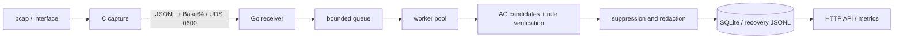

# NetSentry

[中文](README.md)

> Status: v0.1.0 is released; the current review branch contains post-release security hardening and test expansion.

NetSentry is a lightweight C/Go network intrusion detection and pcap forensics engine. The C process performs libpcap offline/live capture, Ethernet/VLAN/IPv4/TCP/UDP parsing, and bounded JSONL serialization. The Go process receives frames over a Unix socket, matches rules, suppresses and redacts alerts, persists aggregated alerts in SQLite, and exposes an HTTP API with Prometheus metrics.

The project targets offline pcap analysis, lab forensics, and resource-constrained edge deployments. It does not aim to replace Suricata or Zeek for 10 Gbps production workloads.

## Quick start

Ubuntu prerequisites: Go 1.22+, GCC, make, libpcap development headers, Python 3, and curl.

```bash
sudo apt install -y build-essential gcc make libpcap-dev golang-go python3 curl
make quickstart
```

`make quickstart` builds `bin/netsentry-capture` and `bin/netsentry-engine`, generates `/tmp/netsentry_test.pcap`, starts the loopback API and `/tmp/netsentry.sock`, analyzes the sample, and prints alerts. The default sample should produce five alerts.

Common API calls:

```bash
curl http://127.0.0.1:8080/api/health
curl "http://127.0.0.1:8080/api/alerts?severity=high&page=1&per_page=20" \
  | python3 -m json.tool
curl http://127.0.0.1:8080/api/metrics
```

## Architecture



Core design:

- The C parser bounds-checks every header offset against captured length and accepts only Ethernet DLT.
- UDS frames are limited to 64 KiB. Payload previews must be Base64 and decode to `payload_len` bytes.
- Rule reload builds a complete immutable `ruleState`, then swaps it once through `atomic.Pointer`.
- Payload rules use Aho-Corasick for candidates, followed by case, protocol, port, direction, and offset/depth verification.
- SQLite aggregates alerts in fixed windows. A recovery JSONL and serialized write critical section preserve recovery semantics with concurrent workers.

## Secure defaults

The HTTP API listens only on `127.0.0.1:8080` by default. A non-loopback address requires authentication with a non-empty Bearer token:

```yaml
engine:
  api_listen_host: "127.0.0.1"
  api_port: 8080
  api_auth_enabled: false
  api_auth_token: "${NETSENTRY_API_TOKEN:}"
```

For remote deployment, set `api_listen_host` to an explicit address, provide `NETSENTRY_API_TOKEN`, enable authentication, and place the service behind a TLS reverse proxy or controlled network. The HTTP server sets read/header/write/idle timeouts and a 16 KiB header limit. Rule and suppression mutation bodies are limited to 1 MiB and exactly one JSON document. pprof is disabled by default and restricted to loopback.

## Detection and MITRE ATT&CK

Supported rule types are `payload_match`, `ip_blacklist`, and `port_blacklist`. Rule files use the `{"rules": [...]}` schema; the loader retains legacy array compatibility.

The v0.1 alert schema stores at most one MITRE technique per rule. Loading validates the canonical technique ID, tactic, and name tuple to prevent typos and silent truncation. Current seed mappings include T1190, T1059.004, T1071, and T1595. A network signature is an indicator consistent with a technique, not proof of successful exploitation.

Current boundaries:

| Item | v0.1 boundary |
|---|---|
| Primary mode | Offline pcap; live capture is experimental |
| Protocols | Ethernet/VLAN/QinQ, IPv4, per-packet TCP/UDP |
| Unsupported | IPv6, TLS decryption, IP/TCP reassembly, application normalization |
| Known bypasses | Split TCP segments, encoding/Unicode, SQL comment insertion |

## Test matrix

```bash
# A. Unit, race, and C ASan tests (serialized to avoid shared bin/ clean/build conflicts)
make test-unit

# B. External-corpus integration tests
make test-integration

# C. pcap -> UDS -> engine -> SQLite -> API end-to-end test
make test-e2e

# D. Configurable end-to-end pressure test
make test-stress
make test-stress STRESS_REPEATS=10000
```

External fixture bytes live beside the source tree in `../NetSentry_TestAssets/` and are not committed to this repository. The tracked `testdata/external-pcaps/manifest.json` locks source revisions, purpose, byte size, SHA-256, and licenses. CI downloads all nine entries into an ephemeral directory, verifies them, and deletes them. Local management commands are:

```bash
../NetSentry_TestAssets/manage_pcaps.py fetch
../NetSentry_TestAssets/manage_pcaps.py verify
```

Additional gates:

```bash
(cd engine && go install golang.org/x/vuln/cmd/govulncheck@v1.6.0)
(cd engine && go install github.com/rhysd/actionlint/cmd/actionlint@v1.7.12)
SUPPLY_CHAIN_FETCH_ASSETS=1 make supply-chain-check
make test-coverage
make fuzz-parser
FUZZ_LONG_ITERATIONS=1000000 make fuzz-parser-long
make fuzz-sustained
PCAP_CORPUS=/path/to/reviewed-corpus make e2e-corpus-pressure
make rc-check
```

Every third-party Action in the CI, Release, and Docker workflows is pinned to a reviewed full commit SHA in `.github/supply-chain-lock.json`. `engine/go.mod` retains the `go 1.22.2` language baseline and pins the CI toolchain to `go1.25.12`. See [docs/supply-chain.md](docs/supply-chain.md) for the update procedure.

External and production pcaps may contain sensitive data. Never commit raw corpora, private paths, or `docs/evidence/local/`. Before sharing, run `make sanitize-pcap INPUT=in.pcap OUTPUT=out.pcap` and manually review the result.

## Build and release

```bash
make build
make dist
make release-artifacts VERSION=0.1.1
make docker-build
make release-gate
```

GitHub Actions runs RC checks for main pushes and pull requests. Version-tag workflows publish GitHub Releases and GHCR images. The signed v0.1.0 tag, Release, and `ghcr.io/decline-llc/netsentry:v0.1.0` were verified on 2026-07-11; see `docs/evidence/release-v0.1.0.md`. Only R90-04 may use anonymized public real-traffic PCAPs after approved privacy, provenance, sanitization, and sensitive-metadata reviews; synthetic/generated traffic remains prohibited and later increments retain their production-derived requirement.

## Project layout

```text
capture/    C capture, protocol parsing, UDS sender, tests/benchmarks/fuzzing
engine/     Go receiver, rules, pipeline, SQLite, API, and metrics
configs/    Runtime configuration, seed rules, and suppressions
docs/       Architecture, API, development, release, and audit documents
scripts/    E2E, pressure, corpus, fuzz, packaging, and knowledge-sync tools
```

## Roadmap

See [AUDIT_REPORT.md](AUDIT_REPORT.md) for the three-month roadmap and complete audit backlog:

- v0.1.1: secure defaults, external fixtures, CI dependency and knowledge gates.
- v0.2.0: unified configuration contract, IPv6/pcapng DLT strategy, UDS connection limits, and performance budgets.
- v0.3.0: IP/TCP reassembly, multiple MITRE mappings with confidence, and a versioned ATT&CK catalog.

## License

MIT. See [LICENSE](LICENSE).
