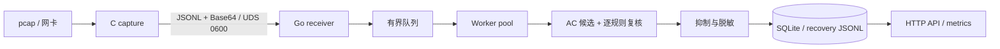

# NetSentry

[English](README.en.md)

> 状态：v0.1.0 已发布；当前审查分支包含发布后的安全加固与测试扩展。

NetSentry 是一个轻量级 C/Go 网络入侵检测与 pcap 取证引擎。C 进程负责 libpcap 离线读取或实时抓包、Ethernet/VLAN/IPv4/TCP/UDP 解析和有界 JSONL 序列化；Go 进程通过 Unix Socket 接收数据，执行规则匹配、告警抑制与脱敏，将聚合告警写入 SQLite，并提供 HTTP API 与 Prometheus 指标。

项目面向离线 pcap、实验室取证和资源受限边缘部署，不以替代 Suricata/Zeek 的 10 Gbps 生产能力为目标。

## 快速开始

Ubuntu 依赖：Go 1.22+、GCC、make、libpcap 开发包、Python 3、curl。

```bash
sudo apt install -y build-essential gcc make libpcap-dev golang-go python3 curl
make quickstart
```

`make quickstart` 会构建 `bin/netsentry-capture` 与 `bin/netsentry-engine`，生成 `/tmp/netsentry_test.pcap`，启动 loopback API 与 `/tmp/netsentry.sock`，分析样本并打印告警。默认样本应产生 5 条告警。

常用 API：

```bash
curl http://127.0.0.1:8080/api/health
curl "http://127.0.0.1:8080/api/alerts?severity=high&page=1&per_page=20" \
  | python3 -m json.tool
curl http://127.0.0.1:8080/api/metrics
```

## 架构



核心设计：

- C parser 对每个 header offset 做 capture-length 边界检查，只接受 Ethernet DLT。
- UDS frame 最大 64 KiB；payload preview 必须为 Base64，解码长度必须与 `payload_len` 一致。
- UDS 处理器数量有限；每个连接默认 30 秒读空闲超时，每个完整帧刷新截止时间。
- 每个 UDS 连接必须以唯一 hello 帧开始；重连会先重发 hello，再发 packet 或 heartbeat。
- 规则 reload 先构建完整不可变 `ruleState`，再通过 `atomic.Pointer` 一次替换。
- payload 规则先用 Aho-Corasick 生成候选，再复核大小写、协议、端口、方向、offset/depth。
- SQLite 以固定时间窗聚合告警；recovery JSONL 与串行写临界区避免并发 worker 破坏恢复语义。

## 安全默认值

HTTP API 默认只监听 `127.0.0.1:8080`。若配置为非 loopback 地址，启动校验会要求同时启用非空 Bearer token：

```yaml
engine:
  api_listen_host: "127.0.0.1"
  api_port: 8080
  api_auth_enabled: false
  api_auth_token: "${NETSENTRY_API_TOKEN:}"
```

对外部署时将 `api_listen_host` 改为明确地址、设置 `NETSENTRY_API_TOKEN`、启用认证，并置于 TLS 反向代理或受控网络之后。HTTP server 设置 read/header/write/idle timeout、16 KiB header 上限；规则与 suppression mutation body 最大 1 MiB，且只能包含一个 JSON 文档。pprof 默认关闭并强制 loopback。

## 检测与 MITRE ATT&CK

支持 `payload_match`、`ip_blacklist`、`port_blacklist`。规则文件使用 `{"rules": [...]}` schema；loader 仍兼容旧数组格式。

v0.1 告警 schema 每条规则最多保存一个 MITRE technique。加载时会校验 technique ID、tactic、name 的 canonical tuple，避免拼写错误和静默截断。当前 seed 映射包括 T1190、T1059.004、T1071、T1595。网络 signature 只表示与 technique 一致的指标，不证明攻击已成功。

当前边界：

| 项目 | v0.1 边界 |
|---|---|
| 主要模式 | 离线 pcap；live capture 为实验能力 |
| 协议 | Ethernet/VLAN/QinQ、IPv4、TCP/UDP 单包 |
| 不支持 | IPv6、TLS 解密、IP/TCP 重组、应用层规范化 |
| 已知绕过 | 跨 TCP segment、编码/Unicode、SQL comment 插入 |

## 测试矩阵

```bash
# A. 单元、race 与 C ASan（串行，避免共享 bin/ 的 clean/build 冲突）
make test-unit

# B. 外部 corpus 集成测试
make test-integration

# C. pcap -> UDS -> engine -> SQLite -> API 端到端测试
make test-e2e

# D. 可调端到端压力测试
make test-stress
make test-stress STRESS_REPEATS=10000
```

外部 fixture 字节位于源码同级 `../NetSentry_TestAssets/`，不进入本仓库 Git。仓库内的 `testdata/external-pcaps/manifest.json` 锁定来源 revision、用途、字节数、SHA-256 与许可证；CI 只下载到临时目录校验 9/9 后删除。日常本地管理命令为：

```bash
../NetSentry_TestAssets/manage_pcaps.py fetch
../NetSentry_TestAssets/manage_pcaps.py verify
```

其他门禁：

```bash
(cd engine && go install golang.org/x/vuln/cmd/govulncheck@v1.6.0)
(cd engine && go install github.com/rhysd/actionlint/cmd/actionlint@v1.7.12)
SUPPLY_CHAIN_FETCH_ASSETS=1 make supply-chain-check
make test-coverage
make fuzz-parser
FUZZ_LONG_ITERATIONS=1000000 make fuzz-parser-long
make fuzz-sustained
PCAP_CORPUS=/path/to/reviewed-corpus make e2e-corpus-pressure
make rc-check
```

CI/Release/Docker workflow 的第三方 Action 均固定到 `.github/supply-chain-lock.json` 中审核过的完整 commit SHA；`engine/go.mod` 保留 `go 1.22.2` 语言基线并固定 CI toolchain `go1.25.12`。更新流程见 [docs/supply-chain.md](docs/supply-chain.md)。

外部/生产 pcap 可能包含敏感内容。不得提交原始 corpus、私有路径或 `docs/evidence/local/`；分享前先运行 `make sanitize-pcap INPUT=in.pcap OUTPUT=out.pcap`，再人工复核。

## 构建与发布

```bash
make build
make dist
make release-artifacts VERSION=0.1.1
make docker-build
make release-gate
```

GitHub Actions 在 main push/PR 执行 RC 检查，version tag 工作流发布 GitHub Release 与 GHCR。v0.1.0 的签名 tag、Release 和 `ghcr.io/decline-llc/netsentry:v0.1.0` 已于 2026-07-11 验证；详细证据见 `docs/evidence/release-v0.1.0.md`。当前 release gate 依据已批准的全局豁免不再要求 PCAP 证据；PCAP 工具仍可用于可选诊断，原始语料、私有路径和本地审查材料不得进入 Git。

## 项目结构

```text
capture/    C 抓包、协议解析、UDS sender、单测/benchmark/fuzz
engine/     Go receiver、规则、pipeline、SQLite、API、指标
configs/    运行配置、seed rules、suppressions
docs/       架构、API、开发、发布与审计文档
scripts/    E2E、压力、corpus、fuzz、打包与知识同步工具
```

## 路线图

三个月路线图与完整审计清单见 [AUDIT_REPORT.md](AUDIT_REPORT.md)：

- v0.1.1：安全默认值、外部 fixture、CI 依赖/知识门禁。
- v0.2.0：统一配置契约、IPv6/pcapng DLT 策略、已落地的 UDS 并发上限、性能预算。
- v0.3.0：IP/TCP 重组、多 MITRE 映射与置信度、可版本化 ATT&CK catalog。

## 许可证

MIT，见 [LICENSE](LICENSE)。
